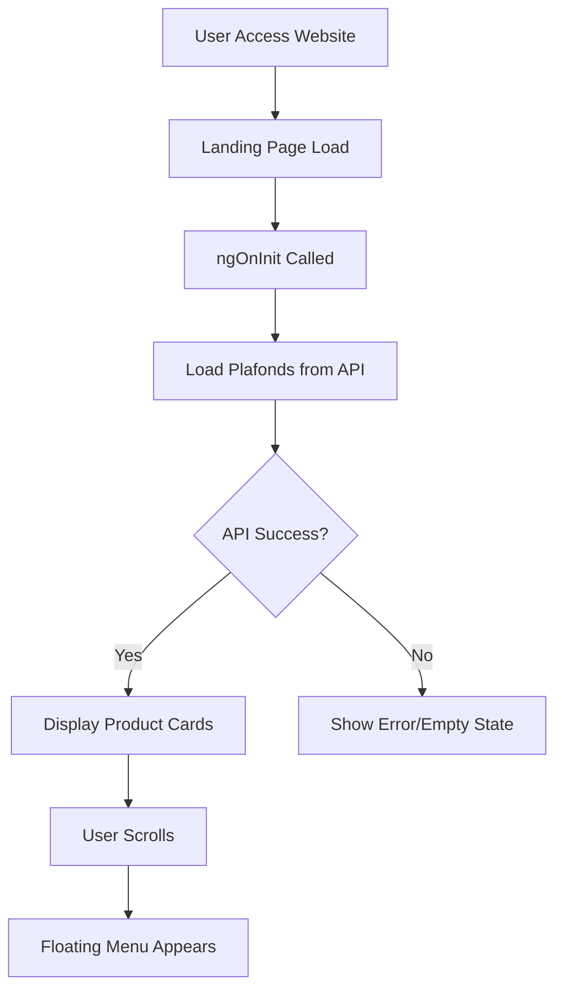

# 🏠 Landing Page Documentation

## Overview
Landing page adalah halaman utama yang pertama kali dilihat user saat mengakses website Loanly. Halaman ini berfungsi untuk menampilkan informasi produk dan menarik user untuk mendaftar/login.

---

## 📁 File Structure
```
src/app/features/landing/
├── landing.component.ts      # Logic & State Management
├── landing.component.html    # Template/View
└── landing.component.css     # Styling
```

---

## 🔄 Flow Diagram


---

## 🧩 Key Components

### 1. Hero Section (Rotating Text)
```typescript
// Rotating words for hero title
heroWords = ['Smart', 'Simple', 'Secure', 'Trusted', 'Modern'];
currentWord = signal(this.heroWords[0]);

startWordRotation() {
    this.rotationInterval = setInterval(() => {
        // Animate out
        this.isAnimating.set(true);
        
        setTimeout(() => {
            // Change word
            const nextIndex = (this.currentWordIndex() + 1) % this.heroWords.length;
            this.currentWord.set(this.heroWords[nextIndex]);
            this.isAnimating.set(false);
        }, 400);
    }, 3000); // Every 3 seconds
}
```

> [!IMPORTANT]
> `ngOnDestroy()` harus clear interval untuk menghindari memory leak!

### 2. Floating Menu (Scroll Detection)
```typescript
@HostListener('window:scroll', [])
onWindowScroll() {
    // Menu muncul setelah scroll 50px
    this.showFloatingMenu = window.scrollY > 50;
}
```

### 3. Product Cards (Tier-based Styling)
```typescript
getTierStyle(plafondName: string) {
    const name = plafondName.toLowerCase();
    
    if (name.includes('plus')) {
        return { btnClass: 'btn-tier-plus', ... };
    } else if (name.includes('gold')) {
        return { btnClass: 'btn-tier-gold', ... };
    }
    // ... dst
}
```

---

## 🎨 Styling Highlights

### Ribbon Graphic (SVG)
- Background graphic menggunakan SVG dengan gradient
- Position: absolute, z-index: 0
- Content sections menggunakan z-index: 2 agar di atas ribbon

### Glassmorphism Effect
```css
.glass-card-solid {
    background: rgba(20, 20, 20, 0.6);
    backdrop-filter: blur(20px);
    border: 1px solid rgba(255, 255, 255, 0.08);
}
```

---

## 📡 API Integration

| Method | Endpoint | Description |
|--------|----------|-------------|
| GET | `/api/public/plafonds` | Fetch daftar produk plafond |

```typescript
loadPlafonds() {
    this.apiService.getPublicPlafonds().subscribe({
        next: (response) => {
            if (response.success) {
                this.plafonds.set(response.data || []);
            }
        },
        error: (error) => console.error('Error:', error)
    });
}
```

---

## ⚠️ Important Notes

1. **Signals (Angular 17+)**: Menggunakan `signal()` untuk reactive state management
2. **Standalone Component**: Tidak perlu NgModule, langsung import dependencies
3. **Lazy Loading**: Component di-load secara lazy via `app.routes.ts`
4. **Responsive**: CSS menggunakan Bootstrap grid + custom media queries
