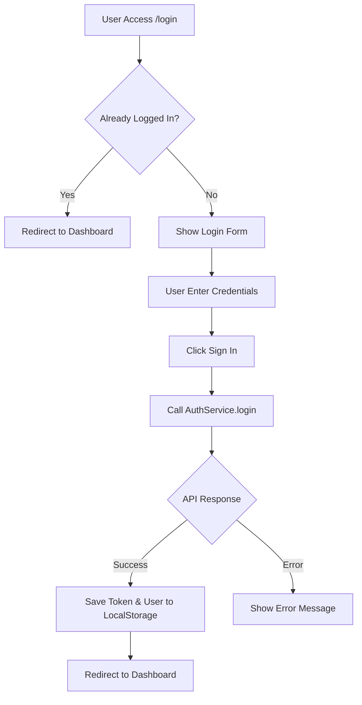

# 🔐 Login Page Documentation

## Overview
Login page adalah halaman untuk autentikasi user. User memasukkan username/email dan password untuk masuk ke dashboard.

---

## 📁 File Structure
```
src/app/features/auth/login/
├── login.component.ts      # Logic & State Management
├── login.component.html    # Template/View
└── login.component.css     # Styling
```

---

## 🔄 Flow Diagram


---

## 🧩 Key Components

### 1. Credential State
```typescript
credentials = {
    usernameOrEmail: '',
    password: ''
};
```

### 2. Reactive State dengan Signals
```typescript
isLoading = signal(false);      // Loading state saat submit
showPassword = signal(false);    // Toggle password visibility
errorMessage = signal('');       // Error message display
```

### 3. Login Submit Handler
```typescript
onSubmit() {
    this.isLoading.set(true);
    this.errorMessage.set('');

    this.authService.login(this.credentials).subscribe({
        next: (response) => {
            if (response.success) {
                this.router.navigate(['/dashboard']);
            }
        },
        error: (error) => {
            this.errorMessage.set(
                error.error?.message || 'Login gagal'
            );
            this.isLoading.set(false);
        }
    });
}
```

---

## 🔒 AuthService Integration

### Login Method
```typescript
// auth.service.ts
login(credentials: LoginRequest): Observable<AuthResponse> {
    return this.http.post<AuthResponse>(`/api/auth/login`, credentials)
        .pipe(
            tap(response => {
                if (response.success && response.data) {
                    this.setSession(
                        response.data.accessToken, 
                        response.data.user
                    );
                }
            })
        );
}
```

### Session Management
```typescript
private setSession(token: string, user: AuthUser): void {
    localStorage.setItem('auth_token', token);
    localStorage.setItem('auth_user', JSON.stringify(user));
    this.currentUserSignal.set(user);
    this.isAuthenticatedSignal.set(true);
}
```

---

## 🛡️ Route Guard

### GuestGuard
Mencegah user yang sudah login mengakses halaman login:

```typescript
// app.routes.ts
{
    path: 'login',
    loadComponent: () => import('./features/auth/login/...'),
    canActivate: [GuestGuard]  // <-- Redirect jika sudah login
}
```

---

## 🎨 UI Features

### Split Layout
| Left Side | Right Side |
|-----------|------------|
| Branding info | Login form |
| Feature cards | Remember me |
| Stats | Forgot password link |

### Password Toggle
```html
<button (click)="togglePassword()">
    <i [class.bi-eye]="!showPassword()" 
       [class.bi-eye-slash]="showPassword()">
    </i>
</button>
```

---

## ⚠️ Important Notes

1. **JWT Token**: Token disimpan di localStorage, auto-check expiry saat app load
2. **Roles**: User roles tersedia di `response.data.user.roles` (array of strings)
3. **Error Handling**: Backend mengembalikan `message` di error response
4. **Remember Me**: Checkbox ada tapi belum diimplementasikan (future feature)

---

## 📡 API Endpoint

| Method | Endpoint | Request Body | Response |
|--------|----------|--------------|----------|
| POST | `/api/auth/login` | `{ usernameOrEmail, password }` | `{ success, data: { accessToken, user } }` |
