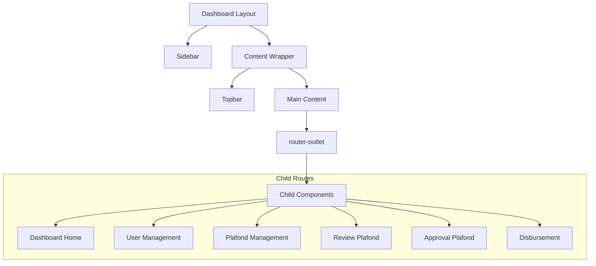

# 📊 Dashboard Layout Documentation

## Overview
Dashboard layout adalah shell/wrapper untuk semua halaman dashboard. Menggunakan sidebar navigation dan topbar yang konsisten di semua child routes.

---

## 📁 File Structure
```
src/app/features/dashboard/layout/
├── dashboard-layout.component.ts
├── dashboard-layout.component.html
└── dashboard-layout.component.css
```

---

## 🔄 Component Architecture


---

## 🧩 Key Features

### 1. Collapsible Sidebar
```css
/* Default: 80px */
.sidebar {
    width: var(--sidebar-width); /* 80px */
    transition: width 0.3s ease;
}

/* Hover: Expand to 220px */
.sidebar:hover {
    width: 220px;
}
```

### 2. Dynamic Menu Items (Role-based)
```typescript
// menu.service.ts
getMenuItems(): MenuItem[] {
    const userRoles = this.authService.userRoles();
    
    return allMenuItems.filter(item => 
        item.roles.some(role => userRoles.includes(role))
    );
}
```

### 3. Router Outlet
```html
<!-- dashboard-layout.component.html -->
<div class="main-content">
    <router-outlet></router-outlet>
</div>
```

---

## 🎨 Layout Structure

```
┌─────────────────────────────────────────────────────┐
│ ┌────────┐ ┌─────────────────────────────────────┐ │
│ │        │ │ TOPBAR                              │ │
│ │  SIDE  │ ├─────────────────────────────────────┤ │
│ │  BAR   │ │                                     │ │
│ │        │ │     MAIN CONTENT                    │ │
│ │  80px  │ │     (router-outlet)                 │ │
│ │   →    │ │                                     │ │
│ │ 220px  │ │                                     │ │
│ │        │ │                                     │ │
│ └────────┘ └─────────────────────────────────────┘ │
└─────────────────────────────────────────────────────┘
```

---

## 📋 Menu Items by Role

| Role | Menu Access |
|------|-------------|
| SUPER_ADMIN | Dashboard, Users, Roles, Plafonds, Review, Approval, Disbursement, Customers, History |
| MARKETING | Review, History |
| BRANCH_MANAGER | Approval, History |
| BACK_OFFICE | Disbursement, History |

---

## 🔐 Route Protection

```typescript
// app.routes.ts
{
    path: 'dashboard',
    loadComponent: () => import('./dashboard-layout...'),
    canActivate: [AuthGuard],  // Must be logged in
    children: [
        {
            path: 'users',
            loadComponent: () => import('./user-list...'),
            canActivate: [RoleGuard],
            data: { roles: ['SUPER_ADMIN'] }  // Role requirement
        }
    ]
}
```

---

## 👤 User Info in Sidebar

```typescript
// Get current user
currentUser = this.authService.currentUser;

// Get primary role
getPrimaryRole(): string {
    return this.authService.getPrimaryRole() || 'User';
}
```

```html
<div class="user-info">
    <div class="user-avatar">
        {{ currentUser()?.username?.charAt(0).toUpperCase() }}
    </div>
    <div class="user-details">
        <div class="user-name">{{ currentUser()?.username }}</div>
        <div class="user-role">{{ getPrimaryRole() }}</div>
    </div>
</div>
```

---

## ⚠️ Important Notes

1. **Lazy Loading**: Semua child components di-load secara lazy
2. **Responsive**: Sidebar collapse di mobile, gunakan overlay
3. **Active Route**: Menu item highlight berdasarkan current route
4. **Logout**: Clear localStorage dan redirect ke login
