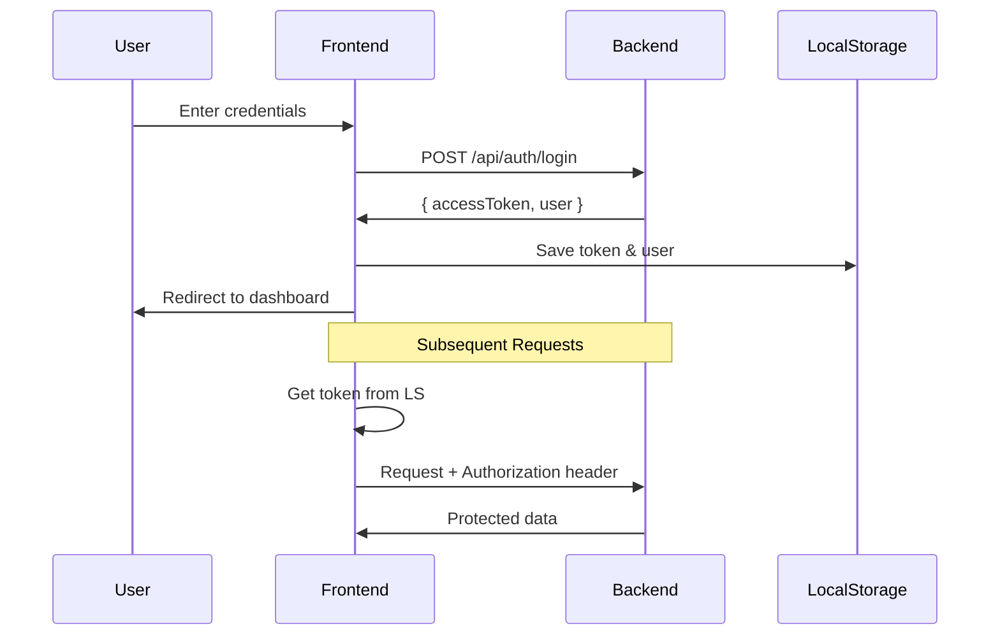

# 🛡️ Authentication & Authorization System

## Overview
Sistem autentikasi dan otorisasi menggunakan JWT (JSON Web Token) dengan role-based access control (RBAC).

---

## 📁 File Structure
```
src/app/core/
├── services/
│   └── auth.service.ts       # Authentication logic
├── guards/
│   └── auth.guard.ts         # Route guards
├── interceptors/
│   └── auth.interceptor.ts   # HTTP interceptor
└── models/
    └── index.ts              # Type definitions
```

---

## 🔐 Authentication Flow


---

## 🧩 AuthService Key Methods

### 1. Login
```typescript
login(credentials: LoginRequest): Observable<AuthResponse> {
    return this.http.post<AuthResponse>('/api/auth/login', credentials)
        .pipe(
            tap(response => {
                if (response.success && response.data) {
                    this.setSession(
                        response.data.accessToken,
                        response.data.user
                    );
                }
            })
        );
}
```

### 2. Session Management
```typescript
private setSession(token: string, user: AuthUser): void {
    localStorage.setItem('auth_token', token);
    localStorage.setItem('auth_user', JSON.stringify(user));
    this.currentUserSignal.set(user);
    this.isAuthenticatedSignal.set(true);
}
```

### 3. Token Validation
```typescript
private hasValidToken(): boolean {
    const token = this.getToken();
    if (!token) return false;

    try {
        // Decode JWT payload
        const payload = JSON.parse(atob(token.split('.')[1]));
        const expiry = payload.exp * 1000;
        return Date.now() < expiry;
    } catch {
        return false;
    }
}
```

### 4. Role Checking
```typescript
hasRole(requiredRoles: string[]): boolean {
    const userRoles = this.userRoles();
    return requiredRoles.some(role => userRoles.includes(role));
}
```

---

## 🛡️ Route Guards

### AuthGuard
```typescript
// Protect routes - must be logged in
export const AuthGuard: CanActivateFn = () => {
    const authService = inject(AuthService);
    const router = inject(Router);

    if (authService.isAuthenticated()) {
        return true;
    }
    
    return router.createUrlTree(['/login']);
};
```

### GuestGuard
```typescript
// Redirect if already logged in
export const GuestGuard: CanActivateFn = () => {
    const authService = inject(AuthService);
    const router = inject(Router);

    if (!authService.isAuthenticated()) {
        return true;
    }
    
    return router.createUrlTree(['/dashboard']);
};
```

### RoleGuard
```typescript
// Check specific roles
export const RoleGuard: CanActivateFn = (route) => {
    const authService = inject(AuthService);
    const router = inject(Router);
    
    const requiredRoles = route.data['roles'] as string[];
    
    if (authService.hasRole(requiredRoles)) {
        return true;
    }
    
    return router.createUrlTree(['/dashboard']);
};
```

---

## 📡 HTTP Interceptor

```typescript
// auth.interceptor.ts
export const authInterceptor: HttpInterceptorFn = (req, next) => {
    const authService = inject(AuthService);
    const token = authService.getToken();

    if (token) {
        req = req.clone({
            setHeaders: {
                Authorization: `Bearer ${token}`
            }
        });
    }

    return next(req);
};
```

### Registrasi di app.config.ts
```typescript
export const appConfig = {
    providers: [
        provideHttpClient(withInterceptors([authInterceptor]))
    ]
};
```

---

## 📊 User Roles

| Role | Access Level |
|------|--------------|
| SUPER_ADMIN | Full access to all features |
| MARKETING | Review plafond applications |
| BRANCH_MANAGER | Approve/reject applications |
| BACK_OFFICE | Process disbursements |

---

## 📦 Data Models

```typescript
interface AuthUser {
    id: number;
    username: string;
    email: string;
    fullName: string;
    phone?: string;
    roles: string[];  // ['SUPER_ADMIN', 'MARKETING', etc]
}

interface LoginRequest {
    usernameOrEmail: string;
    password: string;
}

interface AuthResponse {
    success: boolean;
    message?: string;
    data?: {
        accessToken: string;
        user: AuthUser;
    };
}
```

---

## ⚠️ Important Notes

1. **Token Storage**: Disimpan di localStorage (accessible via XSS, consider httpOnly cookies untuk production)
2. **Token Expiry**: JWT punya `exp` claim, di-check saat app load
3. **Auto Logout**: Jika token expired, user akan di-redirect ke login
4. **Signals**: State management menggunakan Angular Signals (v17+)
5. **Standalone**: Tidak menggunakan NgModule, semua component standalone
