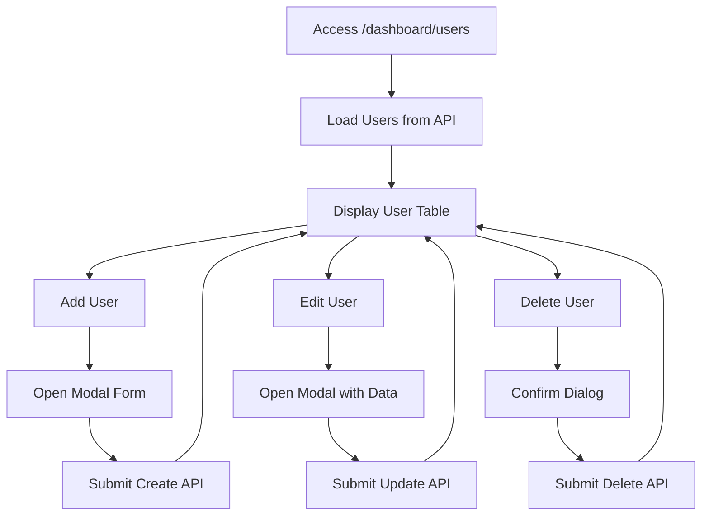

# 👥 User Management Documentation

## Overview
Fitur User Management memungkinkan SUPER_ADMIN untuk mengelola (CRUD) user dalam sistem.

---

## 📁 File Structure
```
src/app/features/dashboard/user-management/
├── user-list.component.ts
├── user-list.component.html
└── user-list.component.css
```

---

## 🔄 Flow Diagram


---

## 🧩 Key Components

### 1. State Management
```typescript
users = signal<User[]>([]);
roles = signal<Role[]>([]);
isLoading = signal(true);
showModal = signal(false);
editingUser = signal<User | null>(null);

// Form data
formData = {
    username: '',
    email: '',
    fullName: '',
    phone: '',
    password: '',
    roleIds: [] as number[]
};
```

### 2. Load Users
```typescript
loadUsers() {
    this.apiService.getUsers().subscribe({
        next: (response) => {
            if (response.success) {
                this.users.set(response.data || []);
            }
        },
        finally: () => this.isLoading.set(false)
    });
}
```

### 3. Create User
```typescript
createUser() {
    const userData = {
        username: this.formData.username,
        email: this.formData.email,
        fullName: this.formData.fullName,
        phone: this.formData.phone,
        password: this.formData.password,
        roleIds: this.formData.roleIds
    };

    this.apiService.createUser(userData).subscribe({
        next: () => {
            this.closeModal();
            this.loadUsers();  // Refresh list
        }
    });
}
```

### 4. Update User
```typescript
updateUser() {
    const userData = {
        username: this.formData.username,
        email: this.formData.email,
        fullName: this.formData.fullName,
        phone: this.formData.phone,
        roleIds: this.formData.roleIds
    };

    this.apiService.updateUser(this.editingUser()!.id, userData)
        .subscribe({
            next: () => {
                this.closeModal();
                this.loadUsers();
            }
        });
}
```

### 5. Delete User
```typescript
deleteUser(user: User) {
    if (confirm(`Delete user ${user.username}?`)) {
        this.apiService.deleteUser(user.id).subscribe({
            next: () => this.loadUsers()
        });
    }
}
```

---

## 📡 API Endpoints

| Action | Method | Endpoint |
|--------|--------|----------|
| Get All Users | GET | `/api/admin/users` |
| Create User | POST | `/api/admin/users` |
| Update User | PUT | `/api/admin/users/{id}` |
| Delete User | DELETE | `/api/admin/users/{id}` |
| Get Roles | GET | `/api/admin/roles` |

---

## 🎨 UI Components

### User Table
```html
<table class="table">
    <thead>
        <tr>
            <th>Username</th>
            <th>Email</th>
            <th>Full Name</th>
            <th>Roles</th>
            <th>Actions</th>
        </tr>
    </thead>
    <tbody>
        @for (user of users(); track user.id) {
            <tr>
                <td>{{ user.username }}</td>
                <td>{{ user.email }}</td>
                <td>{{ user.fullName }}</td>
                <td>
                    @for (role of user.roles; track role) {
                        <span class="badge">{{ role }}</span>
                    }
                </td>
                <td>
                    <button (click)="editUser(user)">Edit</button>
                    <button (click)="deleteUser(user)">Delete</button>
                </td>
            </tr>
        }
    </tbody>
</table>
```

### Modal Form
```html
@if (showModal()) {
    <div class="modal">
        <div class="modal-content">
            <h3>{{ editingUser() ? 'Edit User' : 'Add User' }}</h3>
            
            <input [(ngModel)]="formData.username" placeholder="Username">
            <input [(ngModel)]="formData.email" placeholder="Email">
            <input [(ngModel)]="formData.fullName" placeholder="Full Name">
            
            @if (!editingUser()) {
                <input type="password" [(ngModel)]="formData.password">
            }
            
            <!-- Role Checkboxes -->
            @for (role of roles(); track role.id) {
                <label>
                    <input type="checkbox" 
                           [checked]="formData.roleIds.includes(role.id)"
                           (change)="toggleRole(role.id)">
                    {{ role.name }}
                </label>
            }
            
            <button (click)="submitForm()">Save</button>
            <button (click)="closeModal()">Cancel</button>
        </div>
    </div>
}
```

---

## 🔐 Access Control

```typescript
// app.routes.ts
{
    path: 'users',
    loadComponent: () => import('./user-list.component'),
    canActivate: [RoleGuard],
    data: { roles: ['SUPER_ADMIN'] }  // Only SUPER_ADMIN
}
```

---

## ⚠️ Important Notes

1. **Password**: Hanya required saat create user baru
2. **Role Assignment**: Multiple roles bisa di-assign ke satu user
3. **Self Edit**: User tidak bisa delete diri sendiri
4. **Validation**: Backend validate unique username & email
