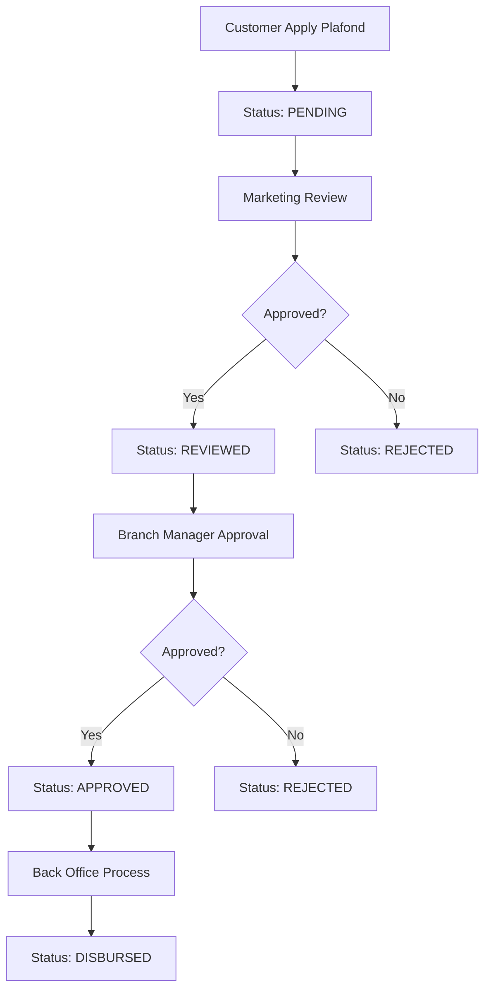

# 💰 Plafond Application Workflow

## Overview
Ini adalah workflow lengkap pengajuan plafond (limit kredit) dari awal hingga pencairan dana.

---

## 🔄 Complete Workflow


---

## 📊 Status Flow

| Step | Status | Actor | Action |
|------|--------|-------|--------|
| 1 | PENDING | Customer | Apply for plafond |
| 2 | REVIEWED | Marketing | Review & verify data |
| 3 | APPROVED | Branch Manager | Final approval + set limit |
| 4 | DISBURSED | Back Office | Process fund disbursement |
| - | REJECTED | Any | Can reject at any step |

---

## 🎯 Role Responsibilities

### 1. Marketing (Review)
- Verify customer data
- Check documents
- Forward to Branch Manager or Reject

```typescript
// review-list.component.ts
reviewApplication(applicationId: number, approved: boolean, note?: string) {
    this.apiService.reviewApplication(applicationId, approved, note)
        .subscribe({
            next: () => this.loadApplications()
        });
}
```

**API Endpoint:**
```
POST /api/marketing/plafond-applications/review
Body: { applicationId, approved, note }
```

---

### 2. Branch Manager (Approval)
- Final decision on application
- Set approved limit (can be different from requested)
- Add notes

```typescript
// approval-list.component.ts
approveApplication(
    applicationId: number, 
    approved: boolean, 
    approvedLimit?: number, 
    note?: string
) {
    this.apiService.approveApplication(
        applicationId, approved, approvedLimit, note
    ).subscribe({
        next: () => this.loadApplications()
    });
}
```

**API Endpoint:**
```
POST /api/branch-manager/plafond-applications/approve
Body: { applicationId, approved, approvedLimit, note }
```

---

### 3. Back Office (Disbursement)
- Process fund transfer
- Add transaction notes

```typescript
// disbursement-list.component.ts
processDisbursement(disbursementId: number, note?: string) {
    this.apiService.processDisbursement(disbursementId, note)
        .subscribe({
            next: () => this.loadDisbursements()
        });
}

cancelDisbursement(disbursementId: number, reason: string) {
    this.apiService.cancelDisbursement(disbursementId, reason)
        .subscribe({
            next: () => this.loadDisbursements()
        });
}
```

**API Endpoints:**
```
POST /api/back-office/disbursements/{id}/process
POST /api/back-office/disbursements/{id}/cancel
```

---

## 📡 Complete API List

### Marketing Endpoints
| Method | Endpoint | Description |
|--------|----------|-------------|
| GET | `/api/marketing/plafond-applications/pending` | Get pending reviews |
| POST | `/api/marketing/plafond-applications/review` | Submit review |

### Branch Manager Endpoints
| Method | Endpoint | Description |
|--------|----------|-------------|
| GET | `/api/branch-manager/plafond-applications/pending` | Get pending approvals |
| POST | `/api/branch-manager/plafond-applications/approve` | Submit approval |

### Back Office Endpoints
| Method | Endpoint | Description |
|--------|----------|-------------|
| GET | `/api/back-office/disbursements/pending` | Get pending disbursements |
| POST | `/api/back-office/disbursements/{id}/process` | Process disbursement |
| POST | `/api/back-office/disbursements/{id}/cancel` | Cancel disbursement |

---

## 🎨 UI Status Badges

```css
.badge-pending {
    background: rgba(245, 158, 11, 0.15);
    color: #F59E0B;  /* Yellow */
}

.badge-approved {
    background: rgba(34, 197, 94, 0.15);
    color: #22C55E;  /* Green */
}

.badge-rejected {
    background: rgba(239, 68, 68, 0.15);
    color: #EF4444;  /* Red */
}

.badge-waiting {
    background: rgba(6, 182, 212, 0.15);
    color: #06B6D4;  /* Cyan */
}
```

---

## 📦 Data Models

```typescript
interface UserPlafond {
    id: number;
    userId: number;
    plafondId: number;
    status: 'PENDING' | 'REVIEWED' | 'APPROVED' | 'REJECTED' | 'DISBURSED';
    requestedLimit: number;
    approvedLimit?: number;
    reviewNote?: string;
    approvalNote?: string;
    reviewedBy?: number;
    approvedBy?: number;
    createdAt: string;
    updatedAt: string;
    user?: User;
    plafond?: Plafond;
}

interface Disbursement {
    id: number;
    userPlafondId: number;
    amount: number;
    status: 'PENDING' | 'PROCESSED' | 'CANCELLED';
    processedBy?: number;
    note?: string;
    createdAt: string;
    processedAt?: string;
}
```

---

## ⚠️ Important Notes

1. **Sequential Flow**: Status harus mengikuti urutan (tidak bisa skip)
2. **Rejection**: Bisa reject di step manapun
3. **Approved Limit**: Branch Manager bisa set limit berbeda dari yang diminta
4. **Notes**: Setiap action bisa punya notes untuk audit trail
5. **History**: Semua action tercatat untuk audit
