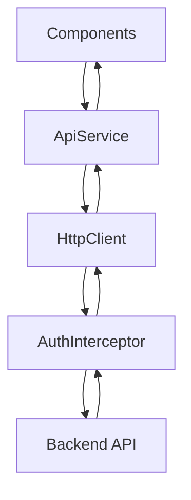

# 📡 API Service Documentation

## Overview
ApiService adalah service utama untuk berkomunikasi dengan backend API. Semua HTTP request ke backend melewati service ini.

---

## 📁 File Location
```
src/app/core/services/api.service.ts
```

---

## 🏗️ Service Structure


---

## 🔧 Base Configuration

```typescript
@Injectable({
    providedIn: 'root'  // Singleton service
})
export class ApiService {
    private readonly baseUrl = environment.apiUrl;  // '/api'

    constructor(private http: HttpClient) { }
}
```

---

## 📋 API Methods by Category

### 🌐 Public Endpoints (No Auth Required)

```typescript
// Get plafond products for landing page
getPublicPlafonds(): Observable<ApiResponse<Plafond[]>> {
    return this.http.get<ApiResponse<Plafond[]>>(
        `${this.baseUrl}/public/plafonds`
    );
}
```

---

### 👥 Admin - User Management

```typescript
// Get all users
getUsers(): Observable<ApiResponse<User[]>> {
    return this.http.get<ApiResponse<User[]>>(
        `${this.baseUrl}/admin/users`
    );
}

// Create user
createUser(user: { 
    username: string; 
    email: string; 
    password: string; 
    roleIds: number[] 
}): Observable<ApiResponse<User>> {
    return this.http.post<ApiResponse<User>>(
        `${this.baseUrl}/admin/users`, 
        user
    );
}

// Update user
updateUser(id: number, user: Partial<User>): Observable<ApiResponse<User>> {
    return this.http.put<ApiResponse<User>>(
        `${this.baseUrl}/admin/users/${id}`, 
        user
    );
}

// Delete user
deleteUser(id: number): Observable<ApiResponse<void>> {
    return this.http.delete<ApiResponse<void>>(
        `${this.baseUrl}/admin/users/${id}`
    );
}
```

---

### 🎖️ Admin - Role Management

```typescript
getRoles(): Observable<ApiResponse<Role[]>> {
    return this.http.get<ApiResponse<Role[]>>(
        `${this.baseUrl}/admin/roles`
    );
}
```

---

### 💳 Admin - Plafond Management

```typescript
// Get all plafonds
getPlafonds(): Observable<ApiResponse<Plafond[]>> {
    return this.http.get<ApiResponse<Plafond[]>>(
        `${this.baseUrl}/admin/plafonds`
    );
}

// Create plafond
createPlafond(plafond: Partial<Plafond>): Observable<ApiResponse<Plafond>> {
    return this.http.post<ApiResponse<Plafond>>(
        `${this.baseUrl}/admin/plafonds`, 
        plafond
    );
}

// Update plafond
updatePlafond(id: number, plafond: Partial<Plafond>): Observable<ApiResponse<Plafond>> {
    return this.http.put<ApiResponse<Plafond>>(
        `${this.baseUrl}/admin/plafonds/${id}`, 
        plafond
    );
}

// Delete plafond
deletePlafond(id: number): Observable<ApiResponse<void>> {
    return this.http.delete<ApiResponse<void>>(
        `${this.baseUrl}/admin/plafonds/${id}`
    );
}
```

---

### 📝 Marketing - Review

```typescript
// Get pending applications for review
getPendingReviewApplications(): Observable<ApiResponse<UserPlafond[]>> {
    return this.http.get<ApiResponse<UserPlafond[]>>(
        `${this.baseUrl}/marketing/plafond-applications/pending`
    );
}

// Submit review decision
reviewApplication(
    applicationId: number, 
    approved: boolean, 
    note?: string
): Observable<ApiResponse<UserPlafond>> {
    return this.http.post<ApiResponse<UserPlafond>>(
        `${this.baseUrl}/marketing/plafond-applications/review`,
        { applicationId, approved, note }
    );
}
```

---

### ✅ Branch Manager - Approval

```typescript
// Get applications waiting for approval
getWaitingApprovalApplications(): Observable<ApiResponse<UserPlafond[]>> {
    return this.http.get<ApiResponse<UserPlafond[]>>(
        `${this.baseUrl}/branch-manager/plafond-applications/pending`
    );
}

// Submit approval decision
approveApplication(
    applicationId: number, 
    approved: boolean, 
    approvedLimit?: number, 
    note?: string
): Observable<ApiResponse<UserPlafond>> {
    return this.http.post<ApiResponse<UserPlafond>>(
        `${this.baseUrl}/branch-manager/plafond-applications/approve`,
        { applicationId, approved, approvedLimit, note }
    );
}
```

---

### 💰 Back Office - Disbursement

```typescript
// Get pending disbursements
getPendingDisbursements(): Observable<ApiResponse<Disbursement[]>> {
    return this.http.get<ApiResponse<Disbursement[]>>(
        `${this.baseUrl}/back-office/disbursements/pending`
    );
}

// Process disbursement
processDisbursement(
    disbursementId: number, 
    note?: string
): Observable<ApiResponse<Disbursement>> {
    let params = new HttpParams();
    if (note) params = params.set('note', note);
    
    return this.http.post<ApiResponse<Disbursement>>(
        `${this.baseUrl}/back-office/disbursements/${disbursementId}/process`,
        null,
        { params }
    );
}

// Cancel disbursement
cancelDisbursement(
    disbursementId: number, 
    reason: string
): Observable<ApiResponse<Disbursement>> {
    const params = new HttpParams().set('reason', reason);
    return this.http.post<ApiResponse<Disbursement>>(
        `${this.baseUrl}/back-office/disbursements/${disbursementId}/cancel`,
        null,
        { params }
    );
}
```

---

## 📦 Response Type

```typescript
interface ApiResponse<T> {
    success: boolean;
    message?: string;
    data?: T;
}
```

**Usage Pattern:**
```typescript
this.apiService.getUsers().subscribe({
    next: (response) => {
        if (response.success) {
            this.users.set(response.data || []);
        }
    },
    error: (error) => {
        console.error('Error:', error);
    }
});
```

---

## ⚠️ Important Notes

1. **Base URL**: Dikonfigurasi di `environment.ts` → `/api`
2. **Proxy**: Development menggunakan proxy untuk forward ke backend
3. **Interceptor**: Token otomatis di-attach via `authInterceptor`
4. **Error Handling**: Components harus handle error secara individual
5. **TypeScript Generics**: Response di-type dengan `ApiResponse<T>`
