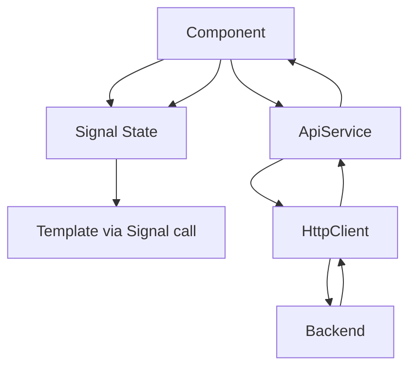

# 📚 Project Structure & Concepts

## Overview
Dokumentasi ini menjelaskan struktur project dan konsep-konsep penting dalam Angular 17+ yang digunakan.

---

## 📁 Project Structure
```
fe-loanlyFinalProject/
├── src/
│   ├── app/
│   │   ├── core/                    # Singleton services & guards
│   │   │   ├── guards/
│   │   │   │   └── auth.guard.ts    # Route guards
│   │   │   ├── interceptors/
│   │   │   │   └── auth.interceptor.ts
│   │   │   ├── services/
│   │   │   │   ├── auth.service.ts  # Authentication
│   │   │   │   ├── api.service.ts   # API calls
│   │   │   │   └── menu.service.ts  # Dynamic menu
│   │   │   └── models/
│   │   │       └── index.ts         # Type definitions
│   │   │
│   │   ├── features/                # Feature modules
│   │   │   ├── auth/
│   │   │   │   ├── login/
│   │   │   │   ├── forgot-password/
│   │   │   │   └── reset-password/
│   │   │   ├── landing/
│   │   │   └── dashboard/
│   │   │       ├── layout/
│   │   │       ├── home/
│   │   │       ├── user-management/
│   │   │       ├── plafond-management/
│   │   │       ├── review-plafond/
│   │   │       ├── approval-plafond/
│   │   │       └── disbursement/
│   │   │
│   │   ├── app.component.ts         # Root component
│   │   ├── app.routes.ts            # Route definitions
│   │   └── app.config.ts            # App configuration
│   │
│   ├── environments/
│   │   └── environment.ts           # Environment config
│   │
│   └── styles.css                   # Global styles
│
├── docs/                            # Documentation
└── proxy.conf.json                  # Dev proxy config
```

---

## 🔑 Key Concepts

### 1. Standalone Components (Angular 17+)
```typescript
@Component({
    selector: 'app-example',
    standalone: true,  // <-- No NgModule needed!
    imports: [CommonModule, FormsModule],  // Import dependencies directly
    templateUrl: './example.component.html'
})
export class ExampleComponent { }
```

> [!NOTE]
> Semua component di project ini adalah standalone, tidak ada NgModule.

---

### 2. Signals (State Management)
```typescript
// Create a signal
users = signal<User[]>([]);
isLoading = signal(true);

// Read signal value
console.log(this.users());

// Update signal
this.users.set([...newUsers]);
this.isLoading.set(false);

// Update based on previous value
this.count.update(v => v + 1);
```

> [!IMPORTANT]
> Signals adalah reactive primitives baru di Angular 17. Lebih simple dari RxJS untuk state management.

---

### 3. Computed Signals
```typescript
// Computed signal - auto-update when dependencies change
readonly userCount = computed(() => this.users().length);
readonly hasUsers = computed(() => this.users().length > 0);
```

---

### 4. Control Flow Syntax (Angular 17+)
```html
<!-- New @if syntax -->
@if (isLoading()) {
    <div>Loading...</div>
} @else {
    <div>Content</div>
}

<!-- New @for syntax -->
@for (user of users(); track user.id) {
    <div>{{ user.name }}</div>
} @empty {
    <div>No users found</div>
}

<!-- New @switch syntax -->
@switch (status) {
    @case ('pending') { <span>Pending</span> }
    @case ('approved') { <span>Approved</span> }
    @default { <span>Unknown</span> }
}
```

---

### 5. Lazy Loading Routes
```typescript
// app.routes.ts
{
    path: 'login',
    loadComponent: () => import('./features/auth/login/login.component')
        .then(m => m.LoginComponent)
}
```

> [!TIP]
> Lazy loading membuat initial bundle lebih kecil, component di-load on-demand.

---

### 6. Functional Guards
```typescript
export const AuthGuard: CanActivateFn = (route, state) => {
    const authService = inject(AuthService);
    const router = inject(Router);

    if (authService.isAuthenticated()) {
        return true;
    }
    
    return router.createUrlTree(['/login']);
};
```

---

### 7. Functional Interceptors
```typescript
export const authInterceptor: HttpInterceptorFn = (req, next) => {
    const authService = inject(AuthService);
    const token = authService.getToken();

    if (token) {
        req = req.clone({
            setHeaders: { Authorization: `Bearer ${token}` }
        });
    }

    return next(req);
};
```

---

## 🎨 Styling Architecture

### CSS Variables (styles.css)
```css
:root {
    --bg-darkest: #1a1d21;
    --accent-blue: #3B82F6;
    --accent-teal: #14B8A6;
    --gradient-primary: linear-gradient(135deg, #60A5FA 0%, #14B8A6 100%);
}
```

### Component Styling
- Setiap component punya file `.css` sendiri
- Styles di-scope ke component tersebut
- Global styles di `styles.css`

---

## 🔄 Data Flow



---

## ⚙️ Environment Configuration

```typescript
// environments/environment.ts
export const environment = {
    production: false,
    apiUrl: '/api'
};
```

### Proxy Configuration (proxy.conf.json)
```json
{
    "/api": {
        "target": "http://localhost:7000",
        "secure": false,
        "changeOrigin": true
    }
}
```

---

## ⚠️ Important Notes

1. **Angular Version**: Project menggunakan Angular 17+ features
2. **No NgModules**: Semua component standalone
3. **Signals**: Digunakan untuk reactive state
4. **Control Flow**: Gunakan `@if`, `@for`, `@switch` (bukan `*ngIf`, `*ngFor`)
5. **Bootstrap**: Menggunakan Bootstrap 5 untuk grid & utilities
6. **Icons**: Bootstrap Icons via CDN
