# 🚀 Deployment Guide - Loanly Frontend

## Overview
Panduan untuk deploy Loanly Frontend ke Vercel dengan CI/CD via GitHub Actions.

---

## 📋 Prerequisites

1. **GitHub Repository** - Push project ke GitHub
2. **Vercel Account** - Daftar di [vercel.com](https://vercel.com)
3. **Backend API** - Backend harus sudah di-deploy dan accessible

---

## 🔧 Step 1: Setup GitHub Repository

```bash
# Initialize git (jika belum)
git init

# Add remote origin
git remote add origin https://github.com/YOUR_USERNAME/fe-loanly-final-project.git

# Add all files
git add .

# Commit
git commit -m "Initial commit - Loanly Frontend"

# Push to main
git push -u origin main
```

---

## 🌐 Step 2: Setup Vercel

### Option A: Via Vercel Dashboard (Recommended untuk pertama kali)

1. Buka [vercel.com](https://vercel.com) dan login
2. Klik **"Add New Project"**
3. Import repository dari GitHub
4. Vercel akan auto-detect Angular project
5. Klik **"Deploy"**

### Option B: Via Vercel CLI

```bash
# Install Vercel CLI
npm install -g vercel

# Login ke Vercel
vercel login

# Deploy (pertama kali)
vercel

# Deploy ke production
vercel --prod
```

---

## 🔑 Step 3: Setup GitHub Secrets untuk CI/CD

Untuk GitHub Actions berjalan otomatis, tambahkan secrets di GitHub repository:

### Get Vercel Tokens:

```bash
# Get project info setelah deploy pertama
vercel link
```

Ini akan membuat file `.vercel/project.json` dengan:
```json
{
  "orgId": "YOUR_ORG_ID",
  "projectId": "YOUR_PROJECT_ID"
}
```

### Add Secrets di GitHub:

1. Buka repository di GitHub
2. Settings → Secrets and variables → Actions
3. Add secrets berikut:

| Secret Name | Value | Cara Dapat |
|-------------|-------|------------|
| `VERCEL_TOKEN` | Personal Access Token | [vercel.com/account/tokens](https://vercel.com/account/tokens) |
| `VERCEL_ORG_ID` | Organization/User ID | Dari `.vercel/project.json` |
| `VERCEL_PROJECT_ID` | Project ID | Dari `.vercel/project.json` |

---

## ⚙️ Step 4: Update Production Environment

Edit file `src/environments/environment.prod.ts`:

```typescript
export const environment = {
    production: true,
    apiUrl: 'https://your-backend-api.com/api'  // Ganti dengan URL backend production
};
```

> [!IMPORTANT]
> Pastikan backend Anda sudah enable CORS untuk domain Vercel!

---

## 🔄 Step 5: CI/CD Workflow

Setelah setup selesai, workflow akan berjalan otomatis:

```mermaid
flowchart LR
    A[Push to main] --> B[GitHub Actions]
    B --> C[Install Dependencies]
    C --> D[Run Tests]
    D --> E[Build Production]
    E --> F[Deploy to Vercel]
    F --> G[Live! 🎉]
```



### Manual Trigger:
```bash
# Push changes
git add .
git commit -m "Update feature"
git push origin main
# → CI/CD otomatis jalan
```

---

## 📁 Files Created

| File | Purpose |
|------|---------|
| `vercel.json` | Vercel deployment configuration |
| `.github/workflows/ci-cd.yml` | GitHub Actions CI/CD pipeline |
| `src/environments/environment.prod.ts` | Production environment variables |

---

## 🔍 Troubleshooting

### Build Error: Output directory not found
```json
// vercel.json - pastikan outputDirectory benar
"outputDirectory": "dist/fe-loanly-final-project/browser"
```

### 404 on page refresh
```json
// vercel.json - pastikan routes ada
"routes": [{ "src": "/(.*)", "dest": "/index.html" }]
```

### CORS Error
Backend harus allow origin dari Vercel domain:
```java
@CrossOrigin(origins = "https://your-app.vercel.app")
```

---

## 🎯 Quick Commands

```bash
# Build locally
npm run build

# Test build output
cd dist/fe-loanly-final-project/browser
npx serve

# Deploy manual
vercel --prod
```
